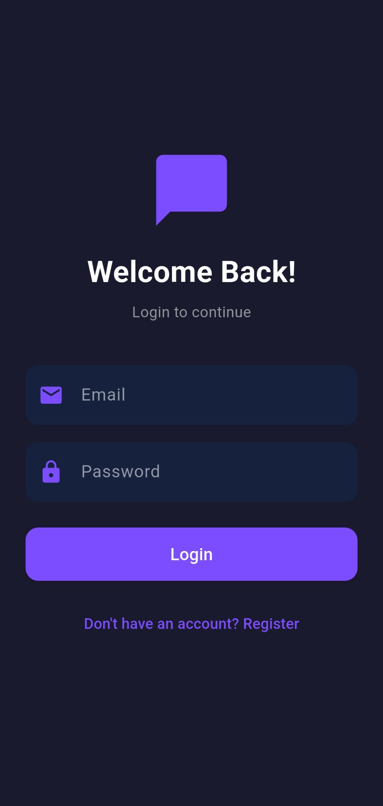
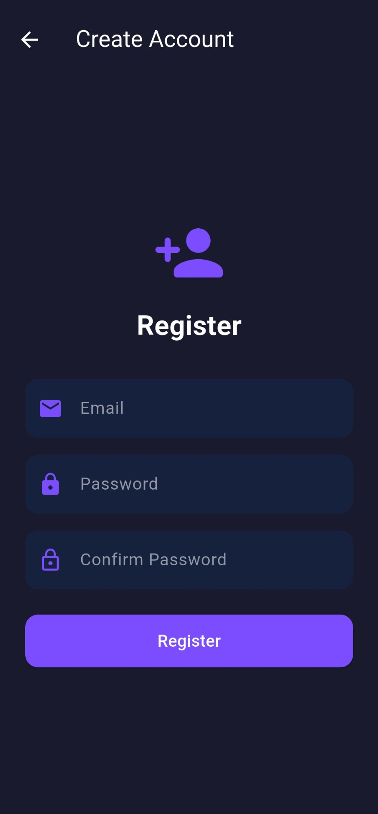
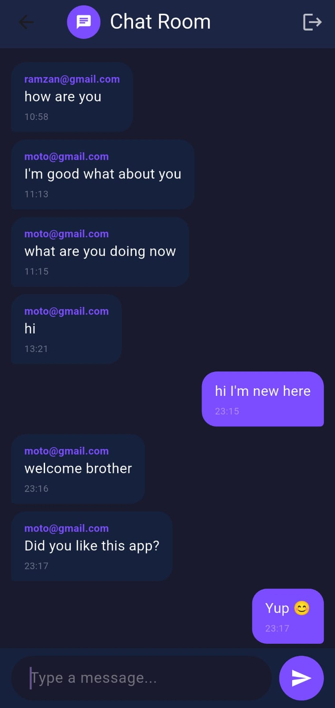

💬 Chat App

A real-time chat application built using Flutter and Firebase, allowing users to register, log in, and communicate instantly within a shared chat room.

📸 Screenshots
<table> <tr> <td align="center"><b>Login Screen</b></td> <td align="center"><b>Register Screen</b></td> <td align="center"><b>Chat Room</b></td> </tr> <tr> <td></td> <td></td> <td></td> </tr> </table>
🚀 Features
🔐 Secure user registration using email and password
🔑 User authentication powered by Firebase
💬 Real-time messaging where all users interact in a shared chat room
📨 Messages display sender email along with timestamps
🟣 Messages sent by the current user appear on the right (purple theme)
🔵 Messages from other users appear on the left (dark theme)
🚪 Logout option available in the AppBar
🌙 Clean dark mode UI with a purple accent theme
🛠️ Tech Stack
Technology	Purpose
Flutter	UI development framework
Firebase Authentication	User login and registration
Cloud Firestore	Real-time database for chat messages
⚙️ Setup
1. Clone the repository
git clone https://github.com/usman448/Flutter-Fellowship.git
cd Flutter-Fellowship/chatapp
2. Install dependencies
flutter pub get
3. Configure Firebase
Open Firebase Console
Create a new project
Enable Authentication → Email/Password
Enable Cloud Firestore
Download google-services.json and place it in android/app/
Sync and run the project
4. Run the application
flutter run
📁 Project Structure
lib/
├── main.dart            # Entry point and Firebase initialization
├── login_screen.dart    # Login interface
├── register_screen.dart # Registration interface
└── chat_screen.dart     # Real-time chat implementation
📦 Dependencies
dependencies:
  firebase_core: latest
  firebase_auth: latest
  cloud_firestore: latest
👨‍💻 Author

Usman — Flutter Developer

📄 License

This project is open-source and distributed under the MIT License.